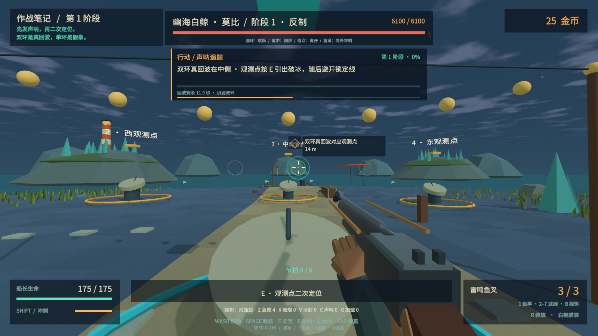

# 潮汐猎手 v0.5 · 探索与反制

这轮针对前版的重复战斗、岛屿缺乏结果、升级感不足和阅读负担进行整合。策划、文案、数值、美术、音乐和测试分别产出内容，再通过实际游戏回归修订。

## 游玩中的变化

- **换一处水域就有新的发现。** 西岸礁隙、湾心水道、东岸海草采用不同物种池。拿起实际钓获的鱼才记录观察；三处记录完成获得一次研究津贴。高级拟饵开放原有水域中尚未发现的物种。
- **任务留下看得见的结果。** 九岛分别呈现灯塔点亮、珊瑚恢复、水道净化、星盘连线、失船记录归档、救生舱乘客归来、接地网络启动、钥匙锻成、七船归航。进度跟随存档，重访仍能看到。
- **故事围绕人展开。** 七艘失踪船、真航灯与海底假灯、工程师一家和循环协议贯穿九岛；对白分段阅读，现场证据需要根据线索判断。人物回应和日志解释下一步为何值得探索。
- **每场首领要求不同动作。** 引钳、回应音序、携水净化、转镜折光、钟拍、护炉、送电、控温压、逆行足迹、钓线牵腕、声呐定位。失误保留已完成的小步骤，工具仍可重试。
- **传说战有阶段策略。** 克拉肯后段必须进入不断换侧的牵引圈，放线时躲腕击；退去触腕可解除额外潮环。白鲸要辨真回波并避开破冰才保存观测；末段每次观测包含两道分别锁定的折返攻击。
- **普通怪和精英更容易读懂。** 普通攻击先蓄势、锁定落点；精英包括可破坏再生鳗皮、交替亮翼、正面钳甲、共生灯、育潮卵、无眼墨影、身体反刺和二次追扑等反制。危险区域显示实际宽度，提示对应移动、冲刺或跳跃。
- **金币购买能兑现技能收益。** 节拍由有效命中积累、弱点加快，失手只扣一部分；蒸汽与热雷各用独立命中计数和冷却。装备与专精仍按金币价格和航线许可证逐步开放。
- **反馈统一。** 精准装填、六枪音色、可调视野与镜头摆动、目标箭头、简化首领名牌、分层战斗配乐、对白和音贝时的背景降音共同服务操作。

## 内容规模与运行

Windows x64 离线单人；Unity 2021.3.16f1c1。运行 `Builds/Release/Tidebreak.exe`，分享使用完整 `Builds/Tidebreak-v0.5.0-Windows-x64.zip`。

当前包含九座主线岛、108 种普通物种条目、11 位首领、12 个体型与精英家族、六枪、金币装备/补给及三幕流派专精。普通物种由体型、攻击、属性和地区造型组合；图鉴条目数不是独立手工模型数。过场使用游戏场景和字幕演出。

## 迭代依据

首版白鲸只需追箭头按交互，功能通过仍被策划退回；重做成识别、引出破冰、成功避让后保存观测。首版克拉肯后两阶段只重复更多触腕，也被退回加入换侧借力及联动压力。截图检查进一步修复近距机关遮挡、菜单叠层、雪地标签对比和错误的原地导航。

回波的双环形状、预警线的真实蓝→橙着色，以及声呐台不遮挡海面，均在运行画面中重新核对。这张图来自第一阶段隔离机制测试；完整首领战另以真实三阶段记录验证。

完整测试证据与自动化边界见 [QA-v05.md](QA-v05.md)。连续新档测试实际执行捕鱼、卖鱼、金币购买、修灯防守、巨蟹三阶段、潮核交付、第二岛购买与保存恢复。测试角色知道解法并精确瞄准；这些证据验证可达性、规则和恢复流程，不能代替真人对手感与乐趣的判断。

最终构建的 `20261004-132915-All-0` 回归为 **638 通过 / 0 失败**，11 场首领全部三阶段结算，运行未发现 C# 异常。Unity 构建 0 错误、1 条未关联云项目的提示；本作离线运行。数值审计另检查 162 组路线 / 命中 / 研究条件组合。

分发包约 **35.68 MiB**，ZIP 的154项条目通过 CRC 检查，包内程序集与本次完整回归一致。构建与压缩包 SHA-256 见 [分发校验](TestResults/v05-package.json)，每场战斗、经济与历史失败修复记录见 [测试归档](TestResults/v05/README.md)。
