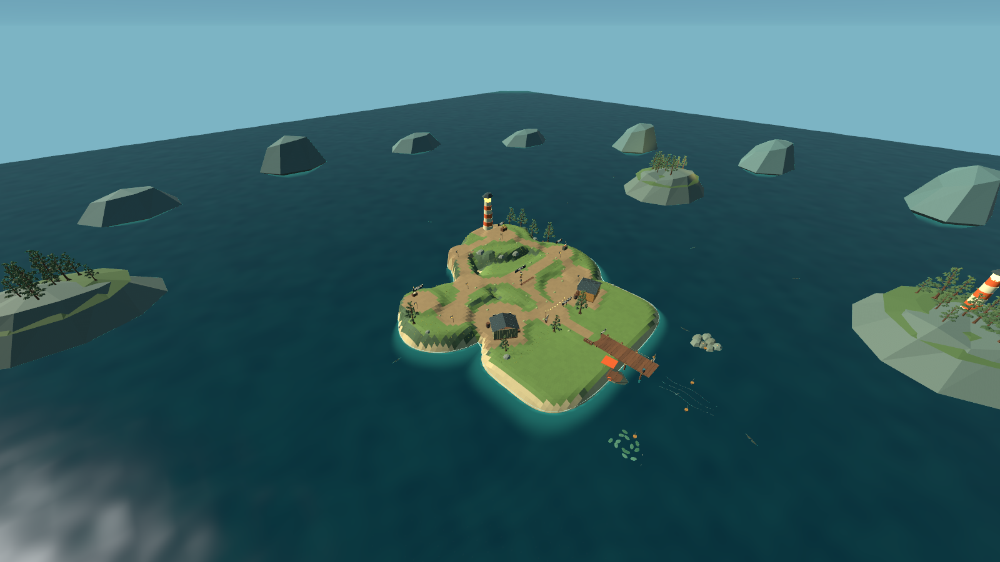
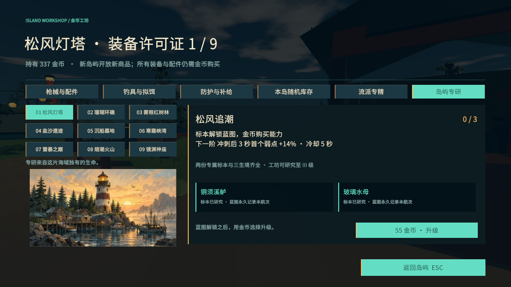
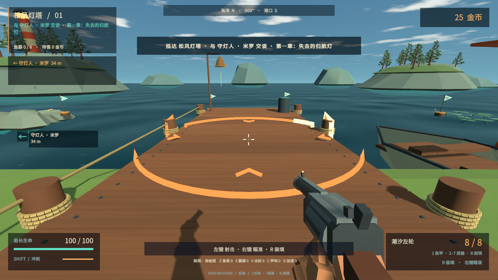

# Tidebreak v0.6 更新说明

本轮把探索、金币成长与战斗表现一起更新。九岛采用不同的地形和路线；专属生物开放岛屿研究，再由玩家用鱼获收入购买能力。普通与精英更需要观察蓄势、处理装置和选择输出窗口。

启动 `Builds/Release/Tidebreak.exe`，或解压完整的 `Builds/Tidebreak-v0.6.0-Windows-x64.zip`。继续使用 Unity 2021.3.16f1c1，无需升级引擎。离线运行，不需要登录。

## 本轮可以体验的变化

**走向任务地点时有路线选择。** 灯塔岛从海岸逐渐爬升，珊瑚岛环绕内湾，湿地需要穿过折桥，寒霜峡湾的热芯任务跨越两岸，后期雷峰、火山与镜渊采用不同高差和环线。市场、工坊、向导、两处任务现场与证据点分别安排；路网与商店院落一起调整，建筑保留实体碰撞。前岸钓鱼和首领区域仍共享安全范围，不能将这项更新理解为九套全新竞技场。

**留下多钓几条鱼有明确目标。** 每岛两种专属生物分别位于西岸和东岸。基础鱼饵可遇到，同一钓场第二次成功收线优先出现尚未解析的专属生物。第一份标本开放一级蓝图，第二份开放二级，三钓场记录开放三级。每一级都需要金币；工坊显示下一阶效果与缺少的条件。

| 岛屿研究 | 鼓励的操作 |
| --- | --- |
| 松风追潮 | 冲刺后命中弱点 |
| 珊瑚折射 | 利用邻近敌人传递弱点伤害 |
| 根须萃取 | 击败自然钓获恢复生命 |
| 日轮破势 | 观察蓄势，射击弱点 |
| 沉钟快装 | 精准装填后打好下一枪 |
| 霜径回身 | 用冲刺拉开追击距离 |
| 避雷蓄能 | 完美闪避后获得一次减伤 |
| 熔心处决 | 对残血目标瞄准弱点 |
| 镜渊换弦 | 命中后换枪继续进攻 |

另外加入六项各三级的金币改装：装填速度、散布回正、精准装填窗口、卸线效率、精英鱼获售价与急救回复。能力与金币都属于本次远征，不是永久无限叠加的基础伤害。

**换岛会换生物池和应对方式。** 每岛十二种原生生物，拟饵等级不同，原生种占池中 78.6%–85.7%；任意两岛共同物种占比最高 21.4%。少数迁徙种按当前岛预算战斗，不带来前期无法承受的终章数值。专属生物不跨岛，召唤幼体不提供标本、金币或生态奖励。

保留 108 个普通物种与 11 位首领，共 119 条图鉴。普通物种由十二个体型家族、主要攻击、属性和九类生态行为组合，精英变体不重复计数；这不是 119 套独立手工模型。

**精英需要先解决它的优势。** 地区行为包括潮线侧步、短时珊瑚护甲、可射断的根芽、双重沙陷、限时修复浮灯、冻结侧路、双柱导电、热壳留地与镜像回声。精英保留体型机制，并提高生命、出招压力和抗推退；持续霰弹不能把它一直打飞。共生灯在鱼实际落地后出现，击破晶核解除保护。

**操作反馈更清楚。** 新曲面生物、鳍条、甲脊与精英饰件统一为海岸低多边形风格。树木、任务设施、共生灯、枪身与手部动画重新处理；九岛光照和海色单独配置。危险圈一开始就显示完整范围，箭头和进度弧提示爆发；弱点、击杀和受击方向分别反馈。右侧行动卡保留瞄准中心，粒子火花、盐雾和枪口闪光补足打击反馈。卡宾枪的连续射击散布、停火回正与握把升级现在实际关联。

## 存档与验证

旧存档保留已有装备、金币、图鉴和剧情进度。新增研究初始为未解锁；旧鱼获可以出售，但不能补领缺少来源记录的专属奖励。鱼获先装篓再离岛。死亡仍重置本局远征。

本次采用策划与生态、世界关卡、美术界面分工，主代理整合并运行 Unity 构建和真实玩家程序验收。失败截图和断言保留，修复后再测。测试范围、构建标识及已知限制见 [验收记录](QA-v06.md)，详细规则见 [生态与经济](ECOLOGY-v06.md)、[地图设计](WORLD-v06.md)、[美术说明](ART-v06.md)。

最终同一构建通过新版 All 739 项、ArtReview 135 项、十一场首领回归 76 项、错误操作检查 88 项、首岛至第二岛剧情及购买保存流程 49 项，均为 0 失败。九岛全部探索路线实际步行通过；后期任务的路程与计时已复审，但这不等于九岛主线均完成无夹具连续通关。安装包完整性与程序集身份见 [打包校验](TestResults/v06-package.json)。

这是持续迭代的可玩开发版本。自动操作可以验证碰撞、购买和战斗规则，但不能代替真人首次游玩的理解成本、鼠标手感与长期乐趣评价。
