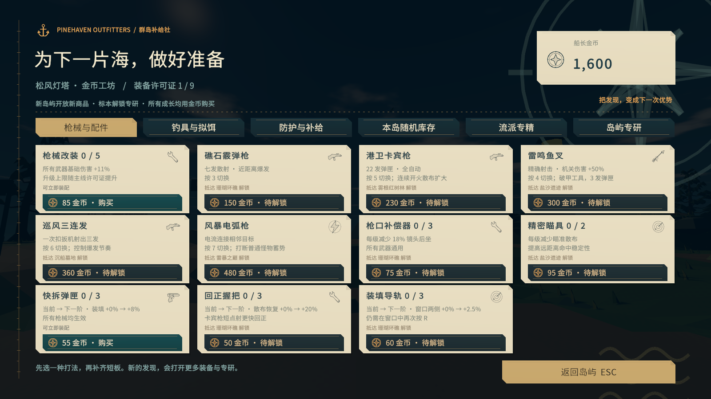
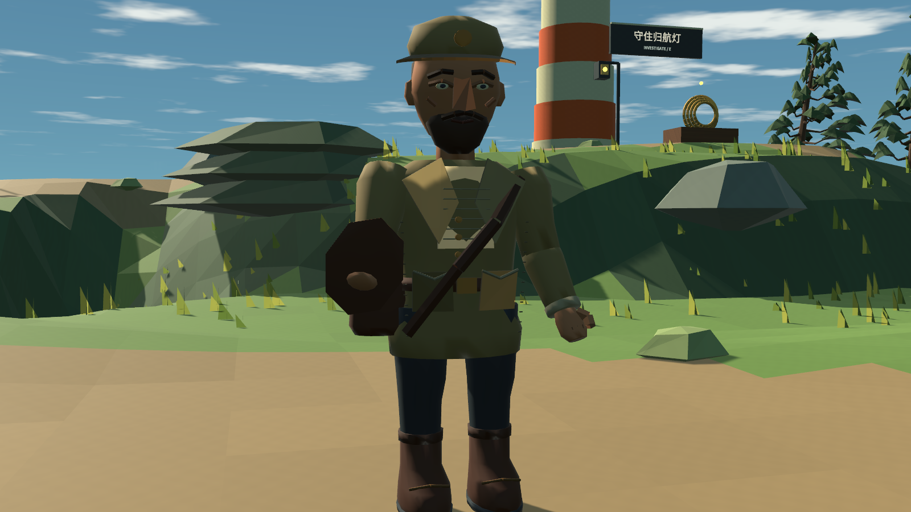
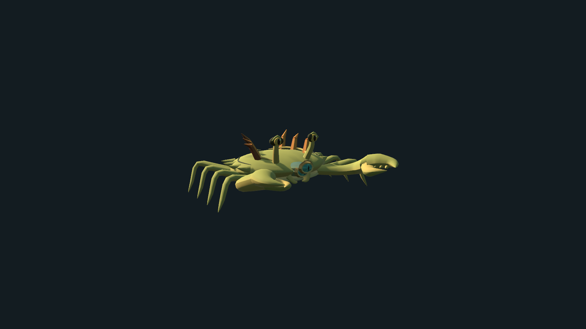
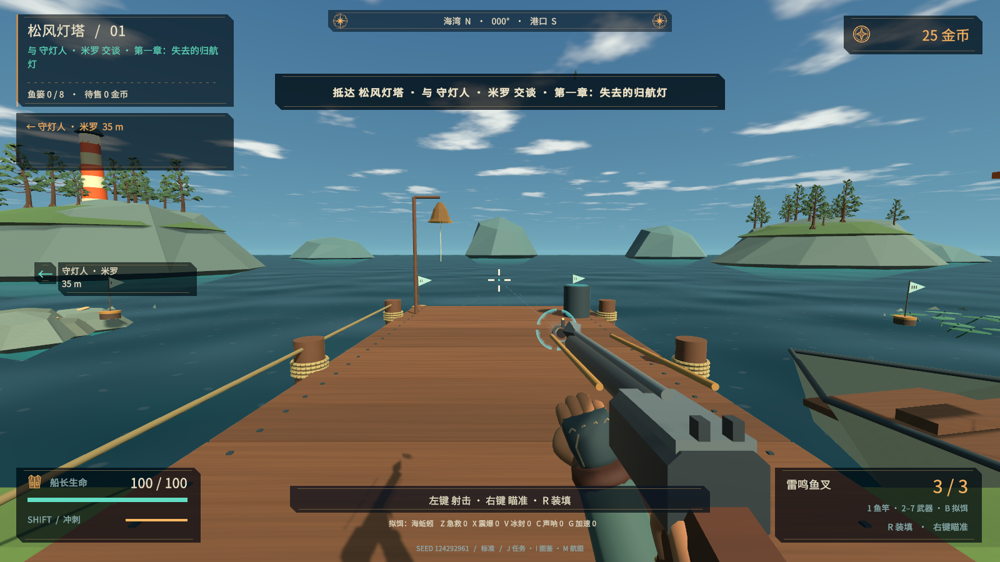

# Tidebreak v0.7 · 航海手记与生物造型

本版针对商店金额缺失、界面简陋、人物和怪物原始体块明显、攻击反馈单薄四项问题。沿用 Unity 2021.3.16f1c1，无需升级编辑器；Windows x64，单人离线游玩。

## 商店金额修复

旧购买按钮给 20 pt 字体的文本区只有 26 px，而 SeaFont 的实际行高约为 28.96 px；配合省略模式，整行价格可能消失。锁定状态还会用解锁说明直接替换金额。

现在每张商品卡都有独立购买条：至少 38 px 高、34 px 文本区、17 pt 单行价格。解锁条件与余额不足说明放在金额上方。未开放商品仍显示下一次购买的目录价格；购买使用原有价格函数，实际扣款与等级上限不变。已拥有或满级显示对应状态，禁止重复扣费。

六页工坊统一为深海蓝绿、暖色纸张和黄铜线条，添加锚、钓轮、鱼叉、枪械、药瓶等矢量图标，使用裁角、纸页折痕、缝线和罗盘刻度。主 HUD、剧情纸页、专研与流派页面沿用同一套视觉语言。装饰不会拦截购买点击。

## 人物与生物建模

向导、工匠和鱼贩改为自建截面网格，包含脸部轮廓、鼻梁、眉眼、发型与胡须、帽冠与帽檐，以及外套翻领、口袋、背带、纽扣、靴型和手指。衣着随地区和角色调整。保留胸部、头部、上下臂、笔记本和面部动画关节；静态细节仅在同一关节内合并，商人脱离场景静态批处理，继续活动。

第一人称手部也换为带指节曲线的半指手套、对握拇指、防水袖口与加固缝线，沿用射击和装填动作。

十二个生物体型家族重新制作解剖轮廓：鱼身与分叉尾、鳃盖、厚翼鳐鱼、分节蟹足与锯齿钳、水母伞体与口腕、海龟壳、鱿鱼长短腕、海马卷尾等。克拉肯有连续腕部、吸盘、眼眶与喙；白鲸有额部、下颌、腹褶、厚尾叶和鳍肢。物种仍由体型家族、地域外观和攻击组合，不能将 119 条图鉴称为 119 套独立模型。

弱点从遮住脸部的高亮白球改为青色虹膜、暗色瞳孔、黄铜边缘与眼睑。原有命中体、位置和弱点判定保留，装饰模型不产生额外碰撞体。

## 攻击与受击表现

六把枪使用不同的枪口层次：火药枪三叶火焰、鱼叉压力环和水针、电弧枪分叉放电与曲折弹道。命中增加方向性火星与盐晶碎片，弱点和击杀分别使用破环与扩散碎屑；入水有冠状浪花与水滴。受击方向箭头、边缘橙色渐层以及普通、弱点、击杀准星反馈分别制作，中心瞄准区域保持清楚。

特效使用固定容量的粒子、网格装饰与弹道池，连续发射复用对象；离岛清理同时覆盖所有三类效果。模型网格有销毁归属，角色细节合并控制绘制对象数量。

## 验收与游玩

执行记录、失败迭代和自动操作边界见 [v0.7 验收记录](QA-v07.md)。商店画面检查覆盖 1600×900、1280×720、1280×1024；隐藏测试窗口产生黑帧时，使用独立世界与 UI 相机读取真实游戏渲染，每张截图记录所用方法。模型检查镜头与实战画面分开标注，没有使用概念图冒充实机效果。

运行 `Builds/Release/Tidebreak.exe`，分发使用完整的 `Builds/Tidebreak-v0.7.0-Windows-x64.zip`。保留九岛地图、地域鱼池、专属研究、金币成长和十一场首领机制。本版完成的是一轮美术与可读性升级，仍需持续真人试玩评价，不将自动测试或风格化网格等同于商业美术品质认证。
