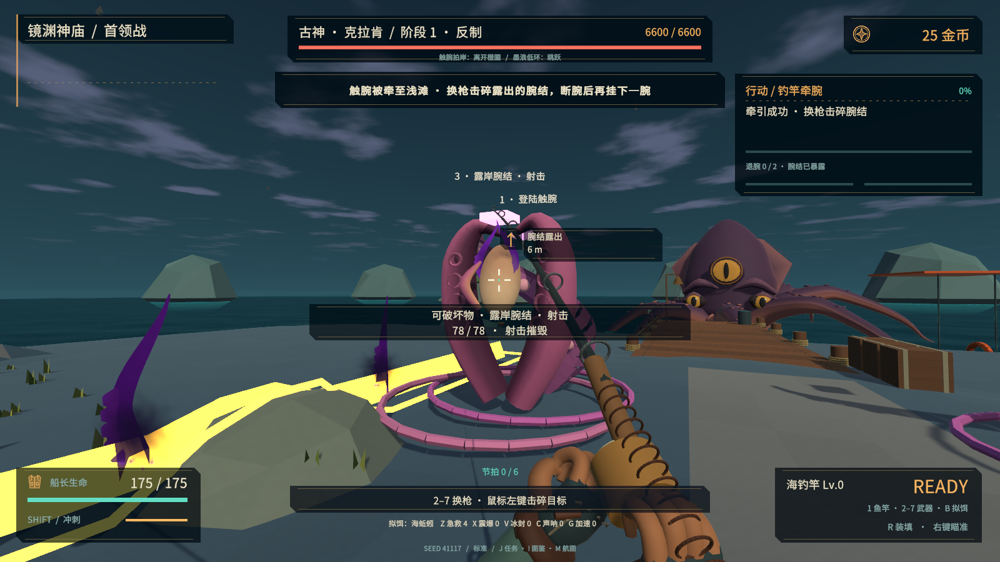
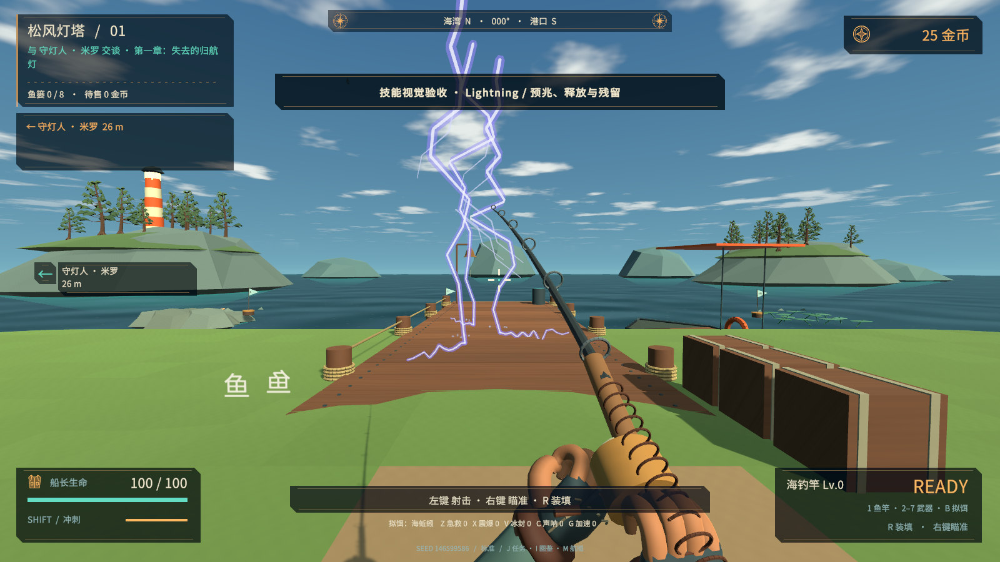
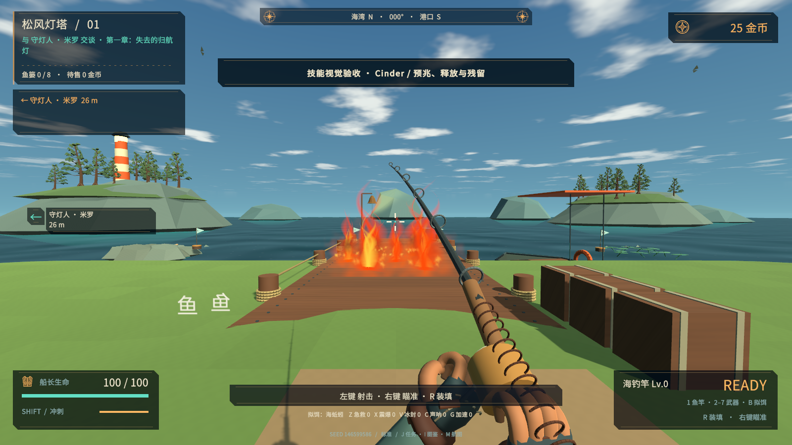
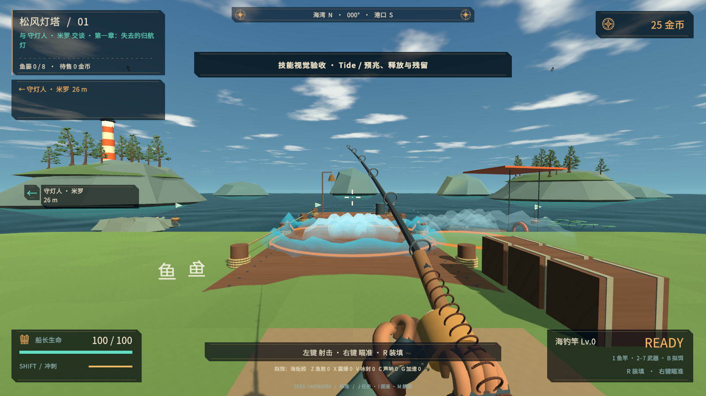
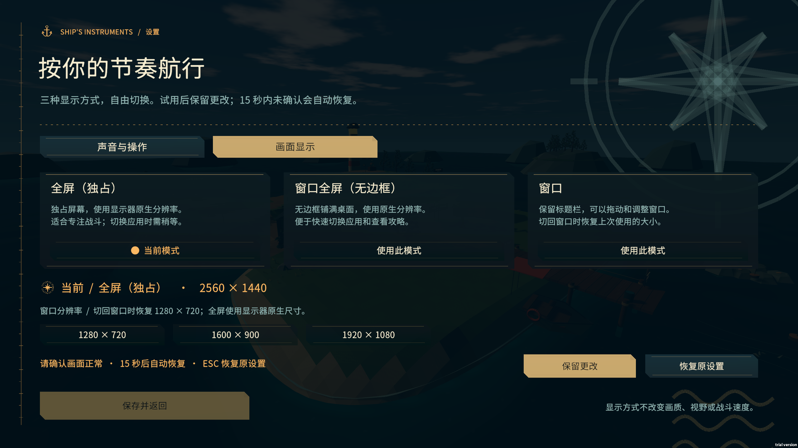

# Tidebreak v0.8 · 破招与元素潮汐

本版重做后六场首领战的推进动作，给敌人技能接入元素与生态特效，并加入独占全屏、无边框窗口全屏和窗口三种显示方式。继续使用 Unity 2021.3 和 Built-in 渲染，保留已有航程、金币成长与图鉴存档。

## 后半程首领

| 首领 | 新的战斗决策 |
| --- | --- |
| 霜脊独角鲸 | 护送热炉，到站补温融锁，再换枪击碎；后两阶段要提前回暖圈躲风雪。 |
| 天线风暴水母 | 先接电，第二阶段起到中继台反相，再送指定接地台；末阶段中继换侧。 |
| 熔甲首领 | 操作双阀维持温压，淬出脆甲后射击；破一片后重新调节，不能只等待读数。 |
| 镜渊吞星者 | 记录自己走过的路线，先离开终点，再逆行回收双晶真足迹；单晶倒影会触发镜刃。 |
| 克拉肯 | 平潮牵腕、红潮松线换侧，腕结露出后切枪破结；只收线不能算断腕。 |
| 幽海白鲸 | 辨识双环回波，后两阶段到另一观测站交叉定位，再避开实际破冰；末阶段独立追踪折返。 |

完成的动作会保留，错误极性、错足迹、断线、观测失败均可继续尝试。动作卡、输入提示、目标标记与计量条读取同一套机制状态。冰锁、火甲和腕结保留实际射击碰撞体，分别制作蓝白多棱冰壳、熔岩甲叶裂隙和卷腕吸盘造型。护炉路线移到开阔岸线，避免树冠挡住冰锁。完整规则见 [战斗设计](DESIGN-v08.md)。

## 技能特效

雷电使用分叉主干、亮芯和地面电弧；熔火使用分层旋动火舌、热雾和上升灰烬；冰霜使用棱状冰刺与雪粒；海潮使用卷浪曲面、浪冠和落下的白沫。另有珊瑚枝、毒根孢子、盐晶、幽灵帆影、镜片、墨触腕与鲸歌声拱。

这些主题已接入实际落点攻击、光带、扩散环、持续地面、漩涡和飞行弹体。治疗、孵化、冲锋、咬击、掘地等动作有不同的升降、合拢或旋转表现。岛屿任务中的冰雨、雷击、熔炉泄流与镜刃也使用相应主题。

119 条物种记录共享 11 类主题库，并结合技能动作与物种差异；并非 119 套独立制作的粒子系统。橙色边界继续指示伤害范围，装饰不增加碰撞体，不改变伤害时机。纯预告不提前播放命中爆发，暂停和离岛会同步处理残留。效果使用有上限的网格、路径、浪面与粒子池，超出容量时替换旧装饰，保留攻击判定与预告。

## 显示设置

进入「设置 → 画面显示」，可选择全屏（独占）、窗口全屏（无边框）或窗口。全屏使用当前显示器原生尺寸；窗口支持常用尺寸选择、拖动调整，并在切回时恢复先前大小。

切换后选择「保留更改」才记住新模式；15 秒不确认会恢复原设置，也可立即点击恢复。预览期间按 Esc 或切页会先撤回，战斗保持暂停。已确认模式随存档保存，下次启动自动应用。

## 运行与验证

运行 `Builds/Release/Tidebreak.exe`，分发使用完整的 `Builds/Tidebreak-v0.8.0-Windows-x64.zip`。每轮构建身份、实际失败与修复、首领三阶段战斗、特效和显示模式测试见 [v0.8 验收记录](QA-v08.md)。自动操作与检查镜头用于发现问题，不等同于真人首次游玩评价。
