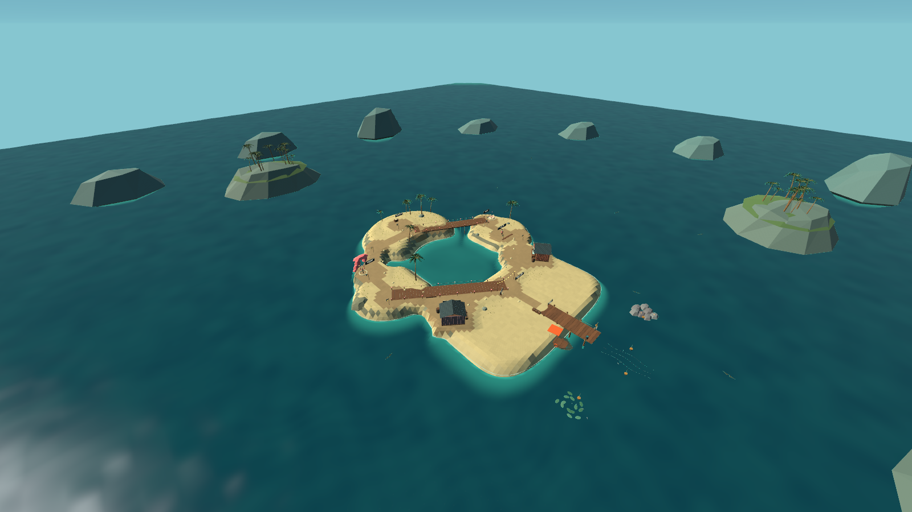
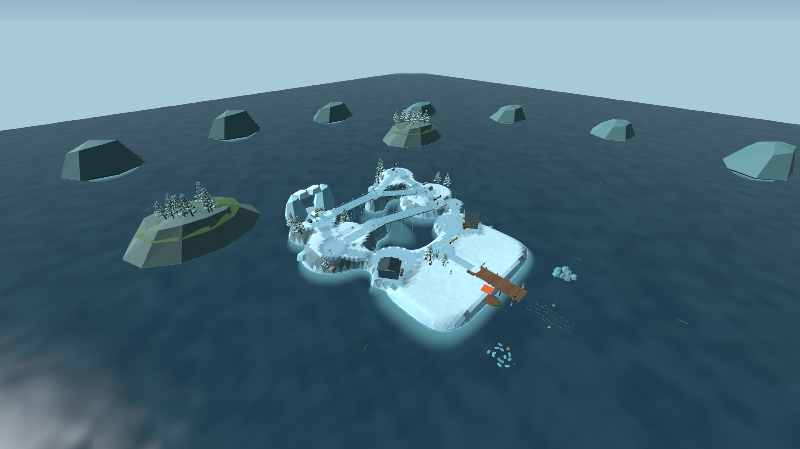

# v0.6 九岛空间与任务路线

本轮重做岛屿内陆的轮廓、高差、道路、聚落朝向和调查位置。每岛有独立的道路图，市场、工坊、向导、两处主线调查点及隐藏日志实际移动到对应地点。下表高度是道路节点的世界高度；公共码头入口为 1.5 米，并非整座岛或建筑的最高点。

| 岛屿 | 空间结构与调查路线 | 最高道路节点 | 道路／桥／回环 |
| --- | --- | ---: | ---: |
| 松风灯塔 | 西侧岬角逐步爬升：电池箱在西坡，透镜在高处灯台；东侧支路通往船长日志，通过后坡回到主路。 | 6.0 m | 14／0／3 |
| 珊瑚环礁 | 两条礁岸围成潟湖：西岸寻找共鸣贝，东岸回应音叉；可绕北侧回环，也可走跨水捷径，隐藏箱在最北端。 | 3.2 m | 13／2／2 |
| 雾根红树林 | 水道将湿地拆成多个小台地，折线栈桥连接净水阀、向导与东后侧滤芯；西北另有走私者日志支路。 | 3.4 m | 14／5／3 |
| 盐沙遗迹 | 三层台地与侧坡上升路线：西侧读日轮石碑，再沿后侧高路登上星盘；东侧分岔抵达封存地图。 | 7.1 m | 14／0／3 |
| 沉船墓地 | 中央曲湾让陆路绕过水面：西侧沉船下载黑匣，后湾接收船钟录音；横跨船坞的通路连接两岸。 | 3.4 m | 13／2／2 |
| 寒霜峡湾 | 两岸阶坡隔着深谷：从西岸热芯站过桥，经中间高台抵达东岸救生舱；雪下日志位于另一条西北支路。 | 6.3 m | 14／3／3 |
| 雷暴之巅 | 高低两条维护路线连接西阵列与东天线；送电经过山脊中段接地环，后侧回环通向工程师的信。 | 7.0 m | 14／1／3 |
| 熔潮火山 | 中央火口分开左右环槽：西侧取钥坯、东侧操作熔炉；可走前方横桥或绕后侧高路，藏宝匣藏在后缘。 | 6.0 m | 13／1／2 |
| 镜渊神庙 | 错层双翼由折桥衔接：西侧记忆棱镜与东侧逆潮祭坛分居两端；后侧裂隙另通第一艘船的日志。 | 7.3 m | 14／4／3 |

每岛有 12 个道路节点，共有 18 座桥。道路设计宽度为 4.6 米，主路节点间最大声明坡度约 0.16（约 9.1°）；这些是布局数据，不替代角色控制器的实际通行验证。桥使用连续坡面碰撞，木板接缝只是外观，不用高低台阶拼出通行面。

## 任务与环境如何接入

- `SeaWorld.NavigationRoute(from, to)` 沿道路图计算路线，再细分为间距不超过约 2 米的路径点；返回高度采样实际地面和桥面。`Layout.Points`、`Routes`、`Landmark`、`BridgeCount`、`LoopCount`、`RouteLength` 可用于检查。
- 红树林净水舟实际沿折线路线行驶，玩家离开伴行范围仍会停船；寒霜暖炉和雷暴接地环位于任务道路上的实际位置，不再用两端直线插值落点。
- 调查点使用电池柜、透镜台、共鸣贝、音叉、净水设备、星盘、黑匣、船钟、救生舱、雷阵、熔炉及记忆装置等模型，摆在道路旁的空位，保留中央通路。隐藏日志使用档案箱。
- 地形增加层状崖壁、桥架、路边照明及明确的泥沙／石灰路径；泡沫沿真实海岸轮廓生成。松树、雪杉、棕榈、风剪铁木、玄武岩柱和镜草分别构成不同轮廓。
- 灯塔修复效果跟随新的灯塔位置；寒霜救援完成后隐藏封闭舱体，展示已有的开舱结果。

## 共享区域与边界

同一验收航拍角度下的实际玩家程序画面：

九岛仍共享前岸首领作战区、钓鱼码头、猎潮钟和西／中／东三个近海生境的操作布局。这样保留已有首领机关、钓线、声呐视线及岸上侧移空间。本轮差异主要发生在内陆探索、地形与任务路线，不能称为九套完全独立的海岸竞技场。克拉肯和白鲸远征继续借用镜渊岛区域。

## 商店挡路修复与验证状态

首轮真实角色行走记录位于 `Builds/Artifacts/V06QA/20261004-160243-World`，结果为 254 PASS、35 FAIL。问题集中在商店：道路经过交互庭院后斜向内陆，所有商店仍统一朝北，后续路径会撞上屋墙、柜台、木桶或货箱。岛 9 左侧卡点距离木桶中心约 0.87 米，与桶、角色及接触余量之和吻合；右侧卡点落在市场柜台前角。

修复对 18 间商店分别设置朝向，将房屋、柜台和杂物整体旋入道路外的院落，同时整平实际建筑基座并禁止植被占用。保留建筑碰撞，没有放宽测试容差或通过瞬移跳过障碍。静态几何检查得到道路中心与商店碰撞轮廓的最小距离为 2.9 米；扣除角色半径后，预期保留至少 5.2 米的通道净宽。

第二轮 `20261004-161642-All` 已完成，整轮 732 PASS、0 FAIL。其中九岛全部六地点往返、两处任务点连线及最终返港路线均实际逐点走通，没有落水恢复或瞬移。前述商店阻挡在这次构建中已消除；后续战斗数值修订与最终构建记录分别见 `QA-v06.md`。

最终 `20261004-164003-All` 在发布候选中再次通过全部 288 项世界检查；4025 条实际路径点记录没有失败。其 [构建身份](TestResults/v06/final-all/build-identity.json) 与最终画面检查相同，[步行记录](TestResults/v06/final-all/world.csv) 随源码保留。

## 任务路程与计时可行性复审

以下为当前源码的路程／计时分析，结合 `Builds/Artifacts/V06QA/20261004-161642-All/world.csv` 中 `mission_connection_b` 的真实角色行走记录。声明路长按道路节点的三维距离计算；实走距离因路径点到达容差与起终点位置稍短。World 测试没有启动这三项任务，因此这些数据证明路线能走通、时间尺度相符，**不代表带敌人完成了三项完整任务**。

| 任务 | A→B 声明路长 | World 实走距离／用时 | 计时与余量 |
| --- | ---: | ---: | --- |
| 岛 3 净水舟 | 63.13 m | 61.71 m／11.87 s | 舟速 1.35 m/s，连续伴行约 46.8 s；没有固定任务倒计时。玩家须在舟旁 8 m 内，否则舟停止。 |
| 岛 6 热芯救援 | 49.53 m | 49.11 m／9.44 s | 基础步速估算 9.52 s。即使途中完全不补热，仅按 3.1 热量/s 冷却，到舱仍约有 70.5 热量。 |
| 岛 7 雷暴送电 | 47.86 m | 47.60 m／9.15 s | 基础步速估算 9.20 s；单轮 14 s 约余 4.8 s，经过实际路程中点的接地环增加 4 s 后约余 8.8 s。 |

寒霜暖炉位于实际任务路线的 43% 和 84% 处。末座暖炉与救生舱中心约距 7.92 m，基础步行约 1.52 s；暖炉作用半径 2.9 m、救生舱供能半径 3.5 m，两圈之间约有 1.52 m 的空隙，因此不能站在同一点无限补热并供能。供能期间热量总消耗为 8.1/s，低于 35 时暂停解冻；退往暖炉补热不会丢失已完成的 18 s 解冻进度。即使持续受到 35% 减速，末炉至舱中心也约需 2.34 s，未出现因新布局而无法往返的热量缺口。战斗走位、受击及错误路线会消耗额外余量，尚需完整任务实战验证。

雷暴三轮分别领取电荷，返回西阵列领取下一轮时没有配送倒计时；超时保留已经交付的轮次。按全程持续 35% 减速作保守估算，单趟约需 14.15 s，经过接地环后仍约余 3.85 s。该估算不计战斗绕行或停步射击，接地环应作为可靠路线提示，而不能据此保证任意战斗策略都能按时送达。

净水舟的风险来自护送战斗而非固定倒计时：每个距舟 5 m 内的敌人每秒削减 3 点完整度，100 点完整度仅能承受单敌连续约 33.3 s 腐蚀，少于整段行舟时间。新路线没有取消清理敌人的要求；舟在玩家离开时会停，但敌人近距腐蚀仍继续。

旧 `IslandRevisionContracts` 用瞬移、无敌和直接消灭敌人的方式验证任务状态；其中寒霜暖炉仍用旧直线插值，雷暴也未验证实际接地延时，不应把未适配的旧测试当成本轮实战证据。后续若增加独立任务实战验证，可复用现有 `NavigationRoute` 与 `V05Move` 的真实移动、状态减速和闪避，按 `MissionPath` 取暖炉／接地点，保留有限生命、真实射击与冷却，并记录舟完整度、每次补热、三轮送电余时及最终任务完成状态。本轮冻结阶段未新增该测试模式。
