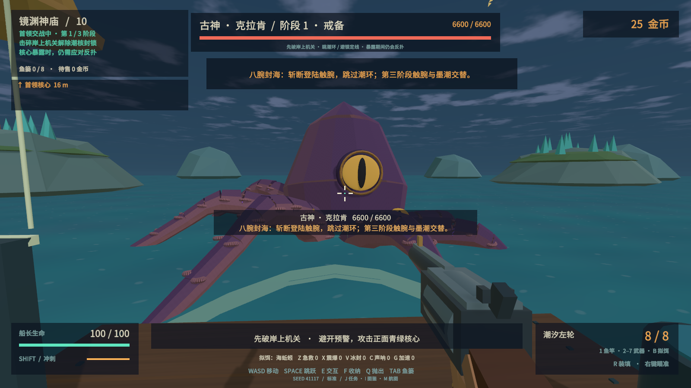
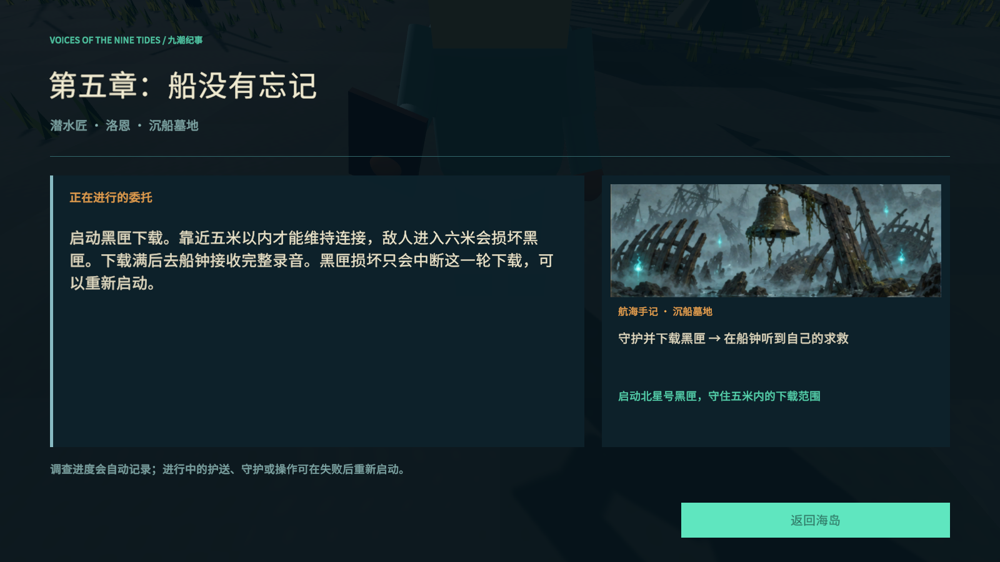

# Tidebreak · 潮汐猎手 v0.4

单人第一人称 3D 海岛钓猎 roguelike，Windows x64，Unity **2021.3.16f1c1**。本版重做首领与精英战斗、金币流派成长、九岛剧情任务和实机演出。



## 开始游玩

双击 `Builds/Release/Tidebreak.exe`。分发请使用完整的 `Tidebreak-v0.4.0-Windows-x64.zip`；无需升级 Unity，运行不需要账号或网络。

1. 找向导按 **E** 接委托，**J** 查看剧情、证据和当前目标。
2. 码头按 **1** 拿鱼竿，蓄力并松开左键抛竿。咬钩后绿灯收线、红灯松手；鱼跃出水面后用枪击倒。
3. **E** 拿鱼、**F** 装篓，到收购柜台售卖换金币。装备与流派专精均要购买。
4. 完成各岛独有委托，在码头摇响猎潮钟。击败首领后回向导交付潮核，开放下一岛。
5. 第 **2 / 5 / 8 岛**开放一幕流派专精，每幕三选一，用金币购买、跨幕搭配。
6. 首领封锁时先击碎岸上机关，核心暴露后仍需躲避反扑。**R** 装填，在绿色区间再按一次可精准速装。

| 操作 | 按键 |
| --- | --- |
| 移动 / 跳跃 / 冲刺 | WASD / Space / 左 Shift |
| 鱼竿 / 左轮 / 霰弹枪 / 鱼叉 | 1 / 2 / 3 / 4 |
| 卡宾枪 / 三连发 / 电弧枪 | 5 / 6 / 7 |
| 开火 / 瞄准 / 装填 | 左键 / 右键 / R |
| 切换拟饵 / 交互 / 收鱼 / 抛鱼 | B / E / F / Q |
| 鱼篓 / 图鉴 / 日志 / 航图 | Tab / I / J / M |
| 急救 / 震爆弹 / 冰封瓶 / 声呐 / 药剂 | Z / X / V / C / G |
| 暂停与保存返回 / 跳过过场 | Esc / Space或Esc |

## v0.4 的主要变化

- **11 位三阶段首领**：独立三招组合、可破坏机关、阶段保护、预警及弱点反击。克拉肯组合登陆触腕、墨潮和潮环；白鲸猎线追踪后锁定，后期加入双向破冰、鲸歌与冰雨。
- **12 类精英反制**：护甲、共生锚、治疗、号令、回旋刃等技能依体型分配。可被弱点打断的种类有冷却，不再靠持续开火永久压制。
- **119 条图鉴记录**：108普通生物、9岛屿首领、2传说首领，变体不充数。普通生物使用12套基础解剖结构加生态变化，首领新增各自剪影；不是119套独立手工模型。
- **成长重新设计**：六枪重设输出、射程和装填；通用伤害升级改为加算且有上限。九项付费专精奖励连续弱点、冲刺进攻、元素组合、低血风险与完美闪避。
- **九岛不同委托**：修灯守护、四拍共鸣、净水舟护送、三轴星盘、黑匣下载、热芯救援、限时送电、双阀锻造、记忆封锚。最后选择影响封锚顺序、终战召唤和结局。
- **演出与动作**：可跳过的入岛、关键证据与终章实机过场；NPC注视、鱼身和触腕弯曲、首领独有关节、武器抽匣/转轮/泵动。九张原创手记插画用于日志和航图，属于插画而非游戏截图。

## 保存



正常退出可继续；死亡重置本局远征，保留图鉴与纪录。旧版存档保留装备金币和已完成岛屿，未完成的委托迁移到新剧情起点。地面鱼获不跨离岛或退出保存，先装篓再走。

存档：`%USERPROFILE%/AppData/LocalLow/XDwudi/Tidebreak`。通关后可继续探索，通过禁忌鱼饵或古神信号开放传说航路。

## 开发与验证

Unity Hub 添加 `Tidebreak`，打开 `Assets/Scenes/Tidebreak.unity`。场景由 C# Editor API 生成。

```powershell
python -X utf8 Tools/prepare_resources.py
./Tools/build.ps1
./Tools/smoke.ps1 -Revision
python -X utf8 Tools/v04_balance_audit.py
./Tools/package.ps1
```

首领回归使用正常受伤、真实弹药/装填/冲刺和有限补给；自动瞄准及任务夹具不代表真人完整试玩。结果和边界见 [验证记录](Documentation/VALIDATION.md)，参数见 [数值设计](Documentation/BALANCE.md)，参考见 [研究记录](Documentation/REFERENCE.md)。本版仍为持续打磨的可玩开发版本，不把自动检查数量等同于商业品质认证。

字体为 Noto Sans SC 子集，遵循 [SIL OFL](ThirdParty/OFL-NotoSans.txt)。[插画生成记录](Documentation/GENERATED-ART.txt) 保存原始提示词与来源。未使用参考游戏的模型、地图、音频或源码。
