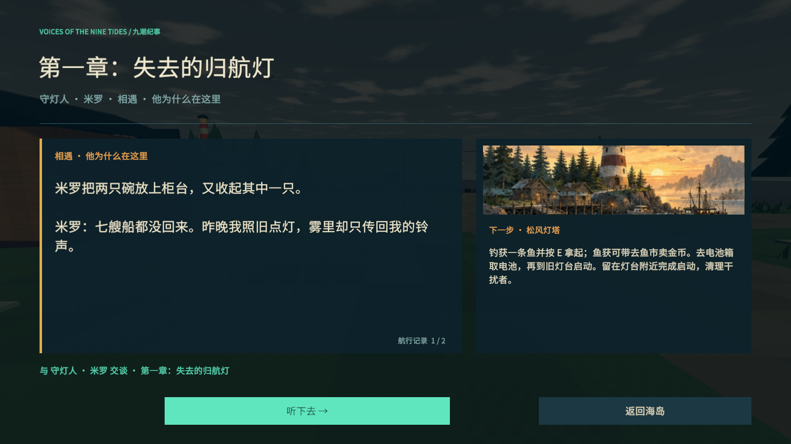

# Tidebreak · 潮汐猎手 v0.7

单人第一人称 3D 海岛钓猎 roguelike，Windows x64，Unity **2021.3.16f1c1**。本版修复商店金币显示，重做航海手记风格界面、船员与生物网格、第一人称手套及分层攻击特效；保留九岛探索与金币研究成长。


## 开始游玩

双击 `Builds/Release/Tidebreak.exe`。分发请使用完整的 `Tidebreak-v0.7.0-Windows-x64.zip`；无需升级 Unity，运行不需要账号或网络。

1. 找向导按 **E** 接委托，**J** 查看剧情、证据和当前目标。
2. 码头按 **1** 拿鱼竿，蓄力并松开左键抛竿。咬钩后绿灯收线、红灯松手；鱼跃出水面后用枪击倒。
3. **E** 拿鱼、**F** 装篓，到收购柜台售卖换金币。装备与流派专精均要购买。
4. 完成各岛独有委托，在码头摇响猎潮钟。击败首领后回向导交付潮核，开放下一岛。
5. 第 **2 / 5 / 8 岛**开放一幕流派专精，每幕三选一，用金币购买、跨幕搭配。
6. 阅读首领行动栏，使用该场战斗的动作：引钳撞桩、音贝应答、净水造岸、折光、拉钟、护炉、导雷、双阀、逆行足迹、牵腕、声呐追踪。射击不能替代这些动作。
7. 换钓场能遇到不同鱼类：西岸礁隙、湾心水道、东岸海草。完成三处真实鱼获观察，获得一次 35 金币津贴；升级拟饵后可重访寻找新物种。
8. 每岛两种专属生物开放本岛三阶研究：击败获得蓝图，再去工坊用金币购买。专研页显示缺失标本、钓场及下一阶效果；基础鱼饵即可开始探索。

| 操作 | 按键 |
| --- | --- |
| 移动 / 跳跃 / 冲刺 | WASD / Space / 左 Shift |
| 鱼竿 / 左轮 / 霰弹枪 / 鱼叉 | 1 / 2 / 3 / 4 |
| 卡宾枪 / 三连发 / 电弧枪 | 5 / 6 / 7 |
| 开火 / 瞄准 / 装填 | 左键 / 右键 / R |
| 切换拟饵 / 交互 / 收鱼 / 抛鱼 | B / E / F / Q |
| 鱼篓 / 图鉴 / 日志 / 航图 | Tab / I / J / M |
| 急救 / 震爆弹 / 冰封瓶 / 声呐 / 药剂 | Z / X / V / C / G |
| 暂停与保存返回 / 跳过过场 | Esc / Space或Esc |

## v0.7 的主要变化

- **价格始终可读**：每张商品卡有独立金额条，解锁说明与余额不足提示另列；修正中文字体行高超过按钮文本区导致整行消失的问题。六页工坊均适用。
- **统一航海手记界面**：暖色纸张、深海蓝绿、黄铜边线，配合折角、缝线、罗盘和装备图标；工坊、专精、研究、剧情及战斗 HUD 使用一致的视觉语言。
- **人物重新建模**：真实截面网格组成脸部、帽檐、外套翻领、背带、手指和靴型；各地区服饰有区别，保留关节动画。第一人称换为曲面手套、指节与袖口。
- **十二类生物的新轮廓**：重新制作鱼身鳃盖、厚翼、蟹钳与分节足、水母伞体与口腕、卷尾等；克拉肯的腕部、吸盘及白鲸的头颌、腹褶、鳍尾分别建模。弱点改为嵌入造型的虹膜器官，保留原有命中判定。
- **分层射击反馈**：火药火焰、鱼叉压力环、电弧分叉、方向性火星、弱点破环、击杀碎屑和冠状水花；命中与受击提示重新设计，特效对象复用。

截图、修复原因与范围见 [v0.7 更新说明](Documentation/RELEASE-v07.md)。以下保留前版的探索与成长内容。

## 九岛探索与成长

- **九岛重新规划地形**：岬角、环礁内湾、红树林水道、盐沙台地、残舰湾、峡湾栈桥、雷峰折道、火山环路和镜渊双翼；任务点、商店、证据点与高差分别布置，每岛有环路和捷径。
- **钓获池区分地域**：每岛十二种原生生物，按拟饵有 78.6%–85.7% 原生种；少量迁徙种保留交叉。两种专属生物不会流入其他岛。普通物种仍由十二个体型家族、攻击和生态组合，并非新增一百套独立模型。
- **停留探索能改变打法**：九条三阶岛屿研究，涉及冲刺弱点、折射、击杀回复、前摇反制、精准装填、减速、避伤蓄能、残血处决和换枪。两份专属标本与三钓场逐步开放购买条件，金币决定投资顺序；另有六项三阶通用改装。
- **普通与精英更有压力**：提高基础生命、攻击与出招频率，九种地域行为叠加体型招式。精英抗持续推退，共生灯需落地后击破，弱点打断有次数节奏；根须种子、修复浮标、导电柱、镜像锚等目标需要先处理。
- **画面和可读性**：重做生物曲面、鳍条与精英饰件，海水随实际水深显露浅滩，统一九岛天空与光照。松树、棕榈、任务设施和共生晶灯有独立轮廓。右侧行动卡让出中心视野，命中、弱点、击杀和受击方向各有反馈。
- **枪械与危险提示**：枪身、转轮、泵动与装填动作更新，卡宾枪连续射击产生真实散布，停火回正与握把升级有关。火花、喷雾与枪口反馈使用复用粒子；地面危险从蓄势开始显示完整边界、箭头与倒计时弧。

## 保留的远征内容

- **11 种首领解法**：真实的方向、顺序、节拍、携带、护送、控温压、路线记忆与钓线张力。克拉肯后期需要换侧进入牵引圈，同时避腕击和潮环；白鲸需要识别双环回波、引出破冰并成功避开，才能留下观测。
- **12 类精英反制**：护甲、共生锚、治疗、号令、回旋刃等技能依体型分配。可被弱点打断的种类有冷却，不再靠持续开火永久压制。
- **119 条图鉴记录**：108 个普通物种条目、9 位岛屿首领、2 位传说首领。普通物种由12个体型家族、攻击模板和地区生态组合，精英不额外计数；不是119套独立手工模型。
- **金币成长**：六枪有各自输出、射程和装填节奏。猎手节拍按有效命中积累、弱点加快；蒸汽和热裂专精各有独立命中计数与冷却，购买专精不再顺带免费赠送元素遗物。
- **九岛不同委托**：修灯守护、四拍共鸣、净水舟护送、三轴星盘、黑匣下载、热芯救援、限时送电、双阀锻造、记忆封锚。最后选择影响封锚顺序、终战召唤和结局。
- **探索和剧情后果**：九组现场证据推理、分段人物对白、可回看的剧情与生态手记；灯塔、珊瑚、净水航道、救生舱、归航船队等实体随进展变化，复访与重载保留结果。
- **演出与动作**：可跳过的入岛、关键证据与终章实机过场；NPC注视、鱼身和触腕弯曲、首领独有关节、武器抽匣/转轮/泵动。九张原创手记插画用于日志和航图，属于插画而非游戏截图。
- **声音与操作反馈**：三幕探索、普通战斗、首领和传说战斗主题，阶段打击乐分层，33 条原创效果音；对白及音贝机制降低背景音乐。普通怪先蓄势再执行锁定攻击，危险区域显示实际宽度和对应闪避动作。

## 保存



正常退出可继续；死亡重置本局远征，保留图鉴与纪录。旧版存档保留装备金币和已完成岛屿，未完成的委托迁移到新剧情起点。地面鱼获不跨离岛或退出保存，先装篓再走。

存档：`%USERPROFILE%/AppData/LocalLow/XDwudi/Tidebreak`。通关后可继续探索，通过禁忌鱼饵或古神信号开放传说航路。

## 开发与验证

本轮范围与实机截图见 [v0.7 更新说明](Documentation/RELEASE-v07.md)，具体证据、失败迭代与测试边界见 [验收记录](Documentation/QA-v07.md)。[v0.6 更新说明](Documentation/RELEASE-v06.md) 与 [v0.5 更新说明](Documentation/RELEASE-v05.md) 保留为历史，不作为新版通过证据。

商店验收检查真实 TMP 字形、价格像素、屏幕边界、点击射线和实际扣款，并保存 1600×900、1280×720、1280×1024 实机画面。另执行模型、特效复用与实际战斗/成长回归；各轮结果与构建身份见验收记录，分发包身份见 [打包校验](Documentation/TestResults/v07-package.json)。自动检查数量不能代表真人游玩质量。

Unity Hub 添加 `Tidebreak`，打开 `Assets/Scenes/Tidebreak.unity`。场景由 C# Editor API 生成。

```powershell
python -X utf8 Tools/prepare_resources.py
./Tools/build.ps1
./Tools/test_v07.ps1 -Mode All
./Tools/smoke.ps1 -ArtReview
./Tools/test_v06.ps1 -Mode Systems
./Tools/test_v05.ps1 -Mode Bosses
./Tools/test_v05.ps1 -Mode Negative
./Tools/test_v05.ps1 -Mode Campaign
python -X utf8 Tools/v06_ecology_audit.py
./Tools/package.ps1
```

首领回归使用正常受伤、真实弹药/装填/冲刺和有限补给；自动瞄准、已知解法及隔离任务夹具不代表真人完整试玩。v0.6 的探索内容见 [生态与经济](Documentation/ECOLOGY-v06.md)、[美术](Documentation/ART-v06.md)，前版 [玩法](Documentation/DESIGN-v05.md)、[剧情](Documentation/STORY-v05.md)、[数值](Documentation/BALANCE-v05.md)、[音频](Documentation/AUDIO-v05.md) 保留为设计历史。本版仍为持续打磨的可玩开发版本，不把自动检查数量等同于商业品质认证。

字体为 Noto Sans SC 子集，遵循 [SIL OFL](ThirdParty/OFL-NotoSans.txt)。[插画生成记录](Documentation/GENERATED-ART.txt) 保存原始提示词与来源。未使用参考游戏的模型、地图、音频或源码。
