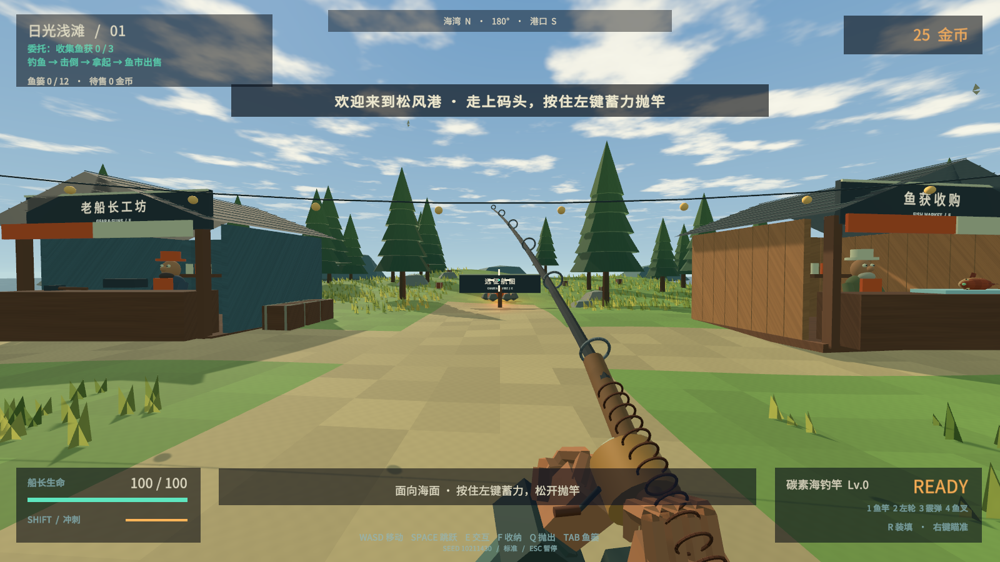
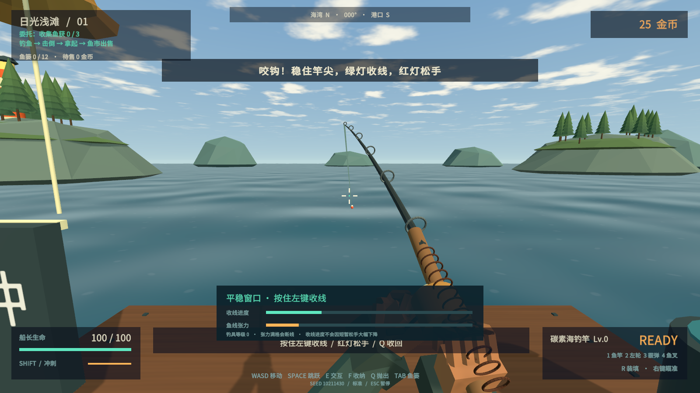

# Tidebreak · 潮汐猎手

单人第一人称 3D 海岛钓猎 roguelike，Windows x64，Unity **2021.3.16f1c1**。v0.2 将最初的甲板波次原型重做为可行走的海岛与实体鱼获循环。



## 开始游玩

双击 `Builds/Release/Tidebreak.exe`。分发时请使用完整的 `Tidebreak-v0.2.0-Windows-x64.zip`，不能只复制 exe。

1. 走到码头，按 **1** 拿鱼竿。朝海面按住左键蓄力，松开抛竿。
2. 咬钩后绿灯按住左键收线，红灯松手降张力。断线可以免费重试。
3. 鱼会跃出海面并落地挣扎，使用武器击倒。凌空击杀和弱点命中会提高售价。
4. **E** 拿起鱼获，**F** 装进鱼篓，**Q** 可以把手中的鱼抛出。
5. 回到挂有「鱼获收购」招牌的柜台，按 **E** 出售。普通鱼击杀本身不会增加金币。
6. 在「老船长工坊」按 **E**，用金币购买枪械、钓具、护甲与随机配件。**没有免费三选一升级。**
7. 完成海域委托后，到港内航图按 **E** 选择下一段路线；也可以留在当前海域继续钓鱼。

| 操作 | 按键 |
| --- | --- |
| 行走 / 观察 / 跳跃 | WASD / 鼠标 / Space |
| 鱼竿 / 左轮 / 霰弹枪 / 鱼叉 | 1 / 2 / 3 / 4 |
| 蓄力抛竿 | 按住左键，松开抛出 |
| 收线 | 平稳时按住左键，挣扎时松手 |
| 开火 / 瞄准 / 装填 | 左键 / 右键 / R |
| 冲刺闪避 | 左 Shift |
| 拿起、售卖、工坊、航图、猎潮钟 | E，靠近对应物体 |
| 收纳 / 投掷鱼获 | F / Q |
| 查看鱼篓 / 暂停 | Tab / Esc |

## 远征内容

- 三片海域、九段委托。岸线、后山、植被、天气色调与环境细节随海域变化；交易据点采用共同布局，便于导航。
- 物理鱼获：抛竿弧线、浮漂、鱼线、拉扯张力、出水、落地扑咬、拿取、投掷、鱼篓和售卖。
- 三种普通鱼、精英个体、巨型个体及金鳞变体。最大体重和金鳞发现保存在永久图鉴。
- 左轮稳定全能；霰弹枪有七发散射和距离衰减；鱼叉单发伤害高、弹匣小，适合远距离弱点打击。
- 枪械、鱼竿、防护背心可用金币分级升级；每个航段有三件随机配件限量售卖，支持不同局内搭配。
- 第 3 / 6 / 9 航段分别有铁壳领主、噬光灯笼鱼、风暴利维坦。准备好后，在码头尽头按 E 摇响猎潮钟。
- 守关首领有半血第二阶段、攻击预警、弱点暴露和失衡窗口。克拉肯拥有连续触腕重击与墨汁弹幕；幽海白鲸有霜潮齐射和延迟冰爆。
- 购买禁忌鱼饵可在主线通关后开启克拉肯；古神信号还可解锁幽海白鲸分支。普通新远征信号概率为 18%，幽光航道另有 20% 独立发现机会。
- 中文菜单、鱼篓、图鉴、设置、轻松模式、自动存档、损坏备份恢复。失败清除本局装备金币，保留图鉴与纪录。




## 工程与构建

Unity Hub 添加 `Tidebreak` 文件夹，打开 `Assets/Scenes/Tidebreak.unity` 并 Play。无需为此版本升级 Unity。

场景和模型由 Unity C# 代码生成；主入口 `GameDirector`，地形与港口 `HarborIsland`，鱼类和装备造型 `CreatureArt` / `ToolArt`。所有模型、着色器、交互规则和合成音频均保存在源码中。

```powershell
./Tools/build.ps1 -UnityPath 'E:/unity/2021.3.16f1c1/Editor/Unity.exe'
./Tools/smoke.ps1
python -X utf8 Tools/balance_audit.py
./Tools/package.ps1
```

`Tools/smoke.ps1 -Visual` 运行较短的交互和渲染检查。测试使用隔离存档，结果与实际摄像机截图输出到 `Builds/Artifacts/IslandQA`。

普通存档位于 `%USERPROFILE%/AppData/LocalLow/XDwudi/Tidebreak`。`voyage.json` 保存金币、鱼篓、已购升级和委托；`captain.json` 保存设置、图鉴与纪录。拿在手里的鱼会在正常退出时尝试收纳，散落在场景中的未收纳鱼获不会跨会话保留。

## 验证与范围

这是可游玩的海岛钓猎雏形，尚不是商业发行完成品。测试覆盖实体鱼获交易、收费升级、碰撞、存档、九段主线及两个稀有首领分支。自动通关使用自动瞄准及受控无敌，验证流程可达性；它不替代真人的操作手感和难度反馈。

详细记录见 [验证记录](Documentation/VALIDATION.md)、[数值设计](Documentation/BALANCE.md) 和 [参考研究与改版范围](Documentation/REFERENCE.md)。目前船只作为港口环境与航线叙事使用，航段切换通过航图完成，没有自由驾驶或多人联网。

中文字体是 Noto Sans SC 子集，遵循 [SIL OFL](ThirdParty/OFL-NotoSans.txt)。TextMesh Pro 由 Unity 包管理器提供。未使用参考游戏的模型、音频、图标或源码。
