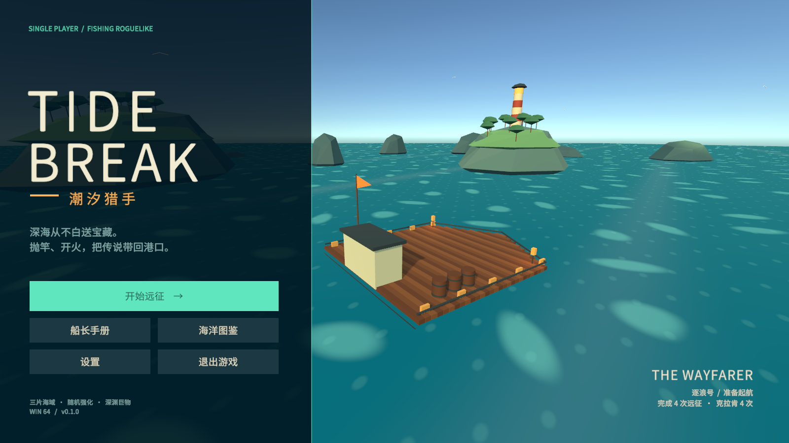

# Tidebreak · 潮汐猎手

Unity 单人第一人称 3D 钓鱼射击 roguelike。面向 Windows 64 位，使用 Unity **2021.3.16f1c1** 开发。灵感是「把危险的鱼钓出来，再用武器收获它们」，场景、怪物造型、规则与音效均为本项目原创。



## 游玩

本地成品位于 `Builds/Release/Tidebreak.exe`。请保留同目录下的 `Tidebreak_Data`、`MonoBleedingEdge` 和 DLL 文件，不能只复制 exe。

每次远征穿过日光浅滩、风暴群礁、幽光深渊，共 9 个钓点。钓起鱼群、射击怪鱼、取得金币和三选一强化，在补给站购买装备，然后选择下一条航线。第 3、6、9 个钓点为守关 BOSS。

| 操作 | 按键 |
| --- | --- |
| 移动、观察 | WASD、鼠标 |
| 抛竿 | 左键 |
| 收线 | 咬钩后按住左键；挣扎时松开 |
| 收回鱼线 | Q |
| 射击 / 瞄准 | 左键 / 右键 |
| 装填 | R；备用弹药无限 |
| 冲刺、短暂无敌 | 左 Shift |
| 左轮 / 霰弹枪 / 鱼叉 | 1 / 2 / 3；后两者需在商店购买 |
| 暂停 | Esc |

**钓鱼提示：** 绿色时收线，红色时松开。张力满格会断线，但可免费重新抛竿。钓具升级会增加收线速度并减少张力增长。

**战斗提示：** 敌方水弹和甲板红圈都可以躲避。BOSS 攻击后会暴露弱点；集中命中发光部位可造成额外伤害与失衡。半血后 BOSS 进入第二阶段。

**克拉肯：** 18% 的新远征拥有古神信号，每次选择幽光航道还有 20% 独立发现机会。购买「禁忌鱼饵」可保证通关后开启克拉肯挑战。进入挑战恢复 50 生命；挑战失败仍保留主线通关纪录。

**幽海白鲸：** 获得古神信号后，通关时还可选择另一场稀有战斗。白鲸使用霜潮弹幕、延迟冰爆和两翼封锁，与克拉肯为两条可选终局分支。

## 已有内容

- 3 个海域色调、原创低多边形群岛、灯塔、逐浪号渔船、动态海水与海鸟。
- 3 种普通鱼及精英变体：赤鳍凶鲷、荆棘河豚、电刃猎鲨。
- 铁壳领主、噬光灯笼鱼、风暴利维坦，以及稀有克拉肯、幽海白鲸；各有独立攻击与第二阶段。
- 左轮、七发霰弹枪、精确鱼叉；枪械、钓具、护甲升级与生命补给。
- 8 类可叠加随机强化、三条航线、自动战利品结算。
- 中文主菜单、教程、图鉴、结算、音量与灵敏度设置、轻松模式。
- 补给站及钓点检查点存档、损坏备份恢复、永久图鉴与远征纪录。
- 原创合成音效和循环背景音乐，无付费资源或网络服务依赖。

## 工程

用 Unity Hub 添加 `Tidebreak` 文件夹，然后打开 `Assets/Scenes/Tidebreak.unity`，点击 Play。

菜单 `Tidebreak > Prepare game scene` 可重新生成入口场景与字体资源；`Tidebreak > Build Windows` 会运行数值/存档验证并打包 Windows 版本。场景由 `GameDirector` 在运行时搭建，所有玩法源代码位于 `Assets/Scripts`。

```powershell
./Tools/build.ps1 -UnityPath 'E:/unity/2021.3.16f1c1/Editor/Unity.exe'
```

游戏存档位于 `%USERPROFILE%/AppData/LocalLow/XDwudi/Tidebreak`。当前航程保存于 `voyage.json`，设置、图鉴及纪录保存于 `captain.json`，写入使用临时文件和备份。离开战斗会返回最近检查点；失败会清除局内进度。

## 验证

编辑器菜单 `Tidebreak > Validate balance and persistence` 验证钓鱼策略、随机强化不重复、属性上限、精英奖励、存档往返与损坏恢复。

集成测试使用独立存档目录：

```powershell
./Tools/smoke.ps1
```

测试会以实际摄像机射线开火，经过钓鱼、战斗、奖励、购买、读档、九个主线钓点、克拉肯与死亡流程，并生成截图。为了稳定覆盖全部流程，通关测试中的自动驾驶使用无敌；它不是难度平衡结论。数值仍需结合真实玩家的命中率、走位和多轮反馈继续调优。

## 资源与许可

原创代码、几何模型、海水着色器和合成音频包含在仓库中。中文字体为 Noto Sans SC 的裁剪版本，遵循 SIL Open Font License，见 `ThirdParty/OFL-NotoSans.txt`。TextMesh Pro 随 Unity 包管理器提供。没有复制参考游戏的模型、音效、剧情或名称。

`Library`、临时文件、构建输出和本地测试截图不提交到 Git；发布包与源码分别交付。

运行 `Tools/package.ps1` 可生成 `Builds/Tidebreak-v0.1.0-Windows-x64.zip`。数值说明见 [BALANCE.md](Documentation/BALANCE.md)，验证记录见 [VALIDATION.md](Documentation/VALIDATION.md)。
