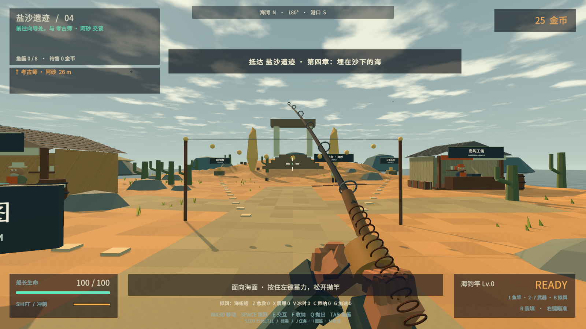
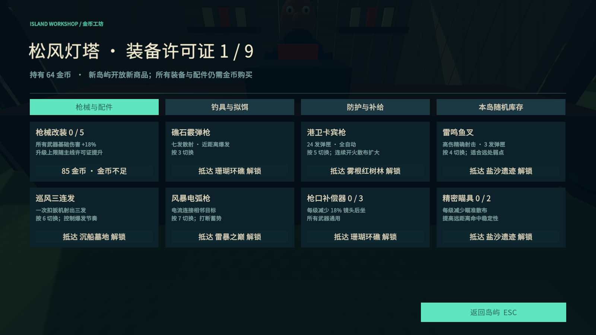
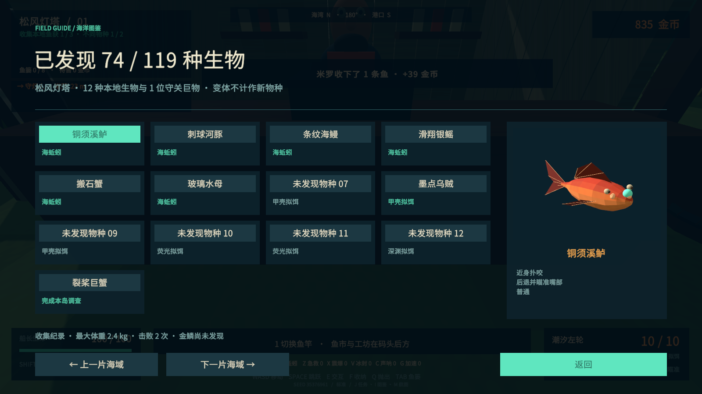

# Tidebreak · 潮汐猎手 v0.3

单人第一人称 3D 海岛钓猎 roguelike，Windows x64，Unity **2021.3.16f1c1**。本版围绕「新岛屿、新物种、新装备、新线索」重做远征推进。



## 开始游玩

双击 `Builds/Release/Tidebreak.exe`。分发使用完整的 `Tidebreak-v0.3.0-Windows-x64.zip`，不要单独复制 exe。本版无需升级 Unity。

1. 先找岛上的向导，按 **E** 接受故事委托。**J** 随时查看当前线索。
2. 去码头按 **1** 拿鱼竿，面朝海面蓄力并松开左键抛竿。咬钩后绿灯收线、红灯松手。
3. 使用武器击倒跃出水面的鱼。**E** 拿起、**F** 装篓；鱼获必须带回收购柜台出售才会增加金币。
4. 用金币购买武器、钓具、拟饵、护甲和配件。新岛开放购买资格；装备不会免费发放。
5. 收集足够的本地鱼获及至少两种不同样本，向向导提交调查。沿任务指示找到两处遗迹，处理守卫。
6. 回向导处获得首领线索，在码头摇响猎潮钟。击败首领后还要回去交付潮核，才能开放下一岛。
7. **M** 查看航图，选择航路并前往新岛。带着高级拟饵重访旧岛，会发现之前无法钓到的物种。

| 操作 | 按键 |
| --- | --- |
| 移动 / 跳跃 / 冲刺 | WASD / Space / 左 Shift |
| 鱼竿 / 左轮 / 霰弹枪 / 鱼叉 | 1 / 2 / 3 / 4 |
| 卡宾枪 / 三连发 / 电弧枪 | 5 / 6 / 7 |
| 开火 / 瞄准 / 装填 | 左键 / 右键 / R |
| 切换已购拟饵 | B |
| 交互 / 收纳鱼获 / 抛出鱼获 | E / F / Q |
| 鱼篓 / 物种图鉴 / 故事日志 / 航图 | Tab / I / J / M |
| 急救包 / 震爆弹 / 冰封瓶 / 声呐 / 加速药剂 | Z / X / V / C / G |
| 暂停、设置、保存返回 | Esc |

## 这次增加了什么

- **108 种有独立图鉴身份的普通生物、9 位岛屿首领、2 位稀有首领，共 119 条记录**。精英、巨型、金鳞不计入物种数量。造型由 12 种身体结构结合比例、附肢、颜色生成，并非 108 套独立手工模型。完整定义见 [物种表](Documentation/species-catalog.csv)。
- **14 种主要攻击机制**：扑咬、冲撞、扇形水弹、落点轰炸、扩散潮环、射线、毒雷、跃击、旋转弹幕、旋涡、治疗、分裂、回旋水刃和潜地突袭；叠加装甲、毒液、冰霜、导电、狂热、汲取、易爆和闪烁特性。
- **9 座不同岛屿与连续剧情**：灯塔、珊瑚、红树林、盐沙、沉船、冰川、雷暴、火山、镜渊神庙。每岛有向导、本地生态、任务遗迹、守卫、隐藏机关和专属地标；交易设施保持一致的用途。
- **23 项固定商品与 20 类随机配件**，按岛屿开放。包含六把枪、四档拟饵、背包扩容、枪口补偿器、瞄具、靴子、元素配件和消耗品。每岛随机库存固定，已购记录跨重访保留。
- 枪械加入回弹后坐、连续开火散布、动态准星、瞄准稳定、弹壳、枪口光、分层音效与命中反馈。弹匣分别记录；切枪取消装填，不会凭空补满。三连发实际发射三颗弹，电弧可连接附近敌人。
- 首领半血转阶段，攻击有预警与反制窗口。发光弱点可实际射中；失衡有恢复间隔，避免高射速无限压制。克拉肯有连续触腕落点与墨汁弹幕；白鲸有独立鲸形轮廓与扇形水刃。
- 图鉴包含旋转 3D 标本、栖息地、拟饵线索、攻击反制、体重与金鳞记录。主线通关后可继续探索、回访补图鉴，并从航图进入稀有首领海域。




## 保存与失败

存档在 `%USERPROFILE%/AppData/LocalLow/XDwudi/Tidebreak`。正常离开可继续远征；死亡清除本局金币、装备与航程，保留图鉴和纪录。主线通关保留完成状态，方便继续探索。v0.2 存档保留装备与金币，按新任务结构重新开始当前岛调查。

拿在手里的鱼正常退出时会尝试装篓。地面上未收纳的鱼不会跨场景或跨会话保留；鱼篓满时先出售。难度可在港口设置中选择，新远征生效。

## 开发与验证

Unity Hub 添加 `Tidebreak`，打开 `Assets/Scenes/Tidebreak.unity` 后运行。模型、地图、界面、音频和规则由工程中的 C# 与着色器生成，运行不需要账号或网络。

```powershell
./Tools/build.ps1
./Tools/smoke.ps1
python -X utf8 Tools/balance_audit.py
./Tools/package.ps1
```

`Tools/smoke.ps1 -Visual` 为较短的视觉检查。测试隔离正式存档，结果和实机截图输出到 `Builds/Artifacts/ExpeditionQA`。构建会额外导出运行时物种 CSV，数值审计直接读取该表。

具体测试结果与局限见 [验证记录](Documentation/VALIDATION.md)，经济和战斗参数见 [数值设计](Documentation/BALANCE.md)，参考依据见 [参考研究](Documentation/REFERENCE.md)。自动通关验证可达性，不替代真人手感和长期平衡反馈。本版为可游玩的开发版本，没有自由驾驶或多人联网。

字体为 Noto Sans SC 子集，遵循 [SIL OFL](ThirdParty/OFL-NotoSans.txt)。未使用参考游戏的模型、地图、音频或源码。
